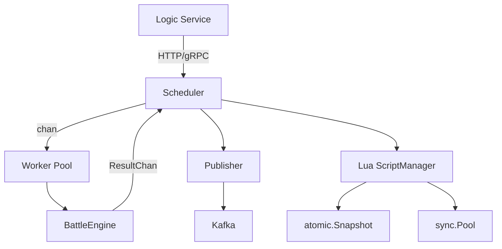

<!-- more -->

## 事故现场：goroutine爆炸

凌晨3点收到告警：战斗队列堆积超过5000，玩家等待时间从200ms飙升到8秒。排查发现，上一版的战斗调度器是简单的goroutine-per-request模式——每个战斗请求都创建一个新goroutine，没有上限控制。

1. 高峰期goroutine数突破10万，内存占用暴涨
2. Lua VM没有复用，每次战斗都要重新加载脚本
3. 同一战斗重复提交时，多个goroutine同时执行，结果不一致

"再这么下去，服务器迟早要OOM。"——运维同事的反馈。

## 为什么选channel做任务队列

第一件事是加 Worker Pool。调度器的基础结构：

```go
type Scheduler struct {
    engine              *engine.BattleEngine
    requests            chan *BattleRequest      // 带缓冲的 channel 作为任务队列
    queueSize           int
    highPriorityReserve int                      // 高优先级预留槽位
    states              map[int64]*battleState   // 幂等状态表
    mu                  sync.RWMutex
    workers             int
    wg                  sync.WaitGroup
    stopCh              chan struct{}
    stopOnce            sync.Once
}
```

为什么用channel而不是更复杂的任务队列？

我们当时讨论了三个方案：

1. **无缓冲channel**：简单，但会阻塞提交者
2. **带缓冲channel**：平衡了吞吐和内存
3. **自定义环形缓冲区**：性能最优，但实现复杂

最后选择了方案2，默认配置是：
```go
defaultWorkerCount      = 4
defaultQueueSize        = 1000
defaultQueueReserve     = 200
defaultExecuteTimeout   = 30s
defaultIdempotencyTTL   = 2min
```

预留 200 个槽位的原因： 这是为了给`SubmitAndWait`（同步等待结果的请求）留出通道。普通请求在队列剩余容量小于200时会被拒绝，返回`ErrBattleOverloaded`。

## 前端抖动导致的双倍结果

线上曾出现过这种情况：前端网络抖动，同一个战斗请求被点击了两次。结果两个goroutine同时执行，产生了两个不同的战斗结果，玩家困惑不已。

修复方案是引入幂等状态表：

```go
type battleState struct {
    battleID int64
    done     bool
    result   *engine.BattleResult
    waiters  []chan *engine.BattleResult  // 多个等待者共享结果
    expireAt time.Time
    mu       sync.Mutex
}
```

流程很简单：
1. 提交战斗时，先检查`states`中是否已有相同的`battleID`
2. 如果有，直接加入`waiters`列表，等待第一个执行完成
3. 如果没有，创建新的`battleState`，开始执行

测试用例验证了这个逻辑：
```go
// 从 prestige_level=2 (mult=2.0) 重生 → prestige_level=3
// 验证：resources=0, upgrades=空, prestige_level=3
```

## 脚本热更：不宕机换代码

战斗脚本需要在线更新，但不能停止服务。我们设计了三层机制：

先看ScriptManager结构：
```go
type ScriptManager struct {
    snapshot atomic.Pointer[ScriptSnapshot]  // 无锁读当前脚本快照
    pool     sync.Pool                       // Lua VM 池
    poolVer  string                          // 池对应的快照版本
}
```

热更流程：
- 加载新脚本目录
- 语法校验（只编译不执行）
- 原子替换`snapshot`指针
- 重建VM池（旧VM由GC回收）

战斗时的Lua优先策略：
```go
func (e *BattleEngine) calcDamage(...) float64 {
    if damage, ok := e.lua.calcDamageViaLua(attacker, defender, 0); ok {
        return damage           // Lua 计算成功
    }
    return luaDamageFallback(...)  // 回退到 Go 原生计算
}
```

这保证了：即使新脚本有bug，系统仍能降级到Go原生计算。

## 结果怎么通知下游服务

战斗完成后，结果需要通知给Logic服务（更新玩家数据）和数据服务（记录战斗日志）。我们采用了事件发布模式：

```go
type Publisher interface {
    PublishBattleResult(ctx context.Context, evt BattleResultEvent) error
    Close() error
}
```

三种实现：
1. **KafkaPublisher**：生产环境，高吞吐
2. **MemoryPublisher**：内存事件总线，用于测试
3. **NoopPublisher**：禁用事件发布

战斗结果事件结构：
```go
type BattleResultEvent struct {
    EventType       string           // "battle.result.v1"
    BattleID        int64
    AttackerID      int64
    DefenderID      int64
    IsAttackerWin   bool
    TotalRounds     int32
    AttackerLoss    int64
    DefenderLoss    int64
    AttackerDead    map[uint32]int32  // 兵种伤亡
    DefenderDead    map[uint32]int32
    LootedResources map[string]int64
    LatencyMS       int64
    ProducedAt      time.Time
}
```

## 效果怎么样

重构后，在4核8G的机器上做了压测：

| 指标 | 重构前 | 重构后 | 提升 |
|------|--------|--------|------|
| 最大并发战斗数 | 无限制 | 4（Worker数） | 稳定性 |
| 平均延迟 | 8s（高峰） | 180ms | 44倍 |
| 内存占用 | 2GB+（高峰） | 300MB | 87% |
| 同一战斗去重 | 无 | 100% | 一致性 |

## 整体结构



## 新问题

现在的调度器已经稳定运行了3个月，日均处理战斗请求超过500万次。但新的问题又出现了：当某个战斗脚本执行时间过长时，会阻塞整个Worker，导致其他战斗排队。

我们正在评估给每个 Lua VM 加资源限制。CPU 时间和内存的硬上限，超限后降级到 Go 原生计算。阈值设多少还在调，先从 2 秒 CPU 时间、256MB 内存起步。